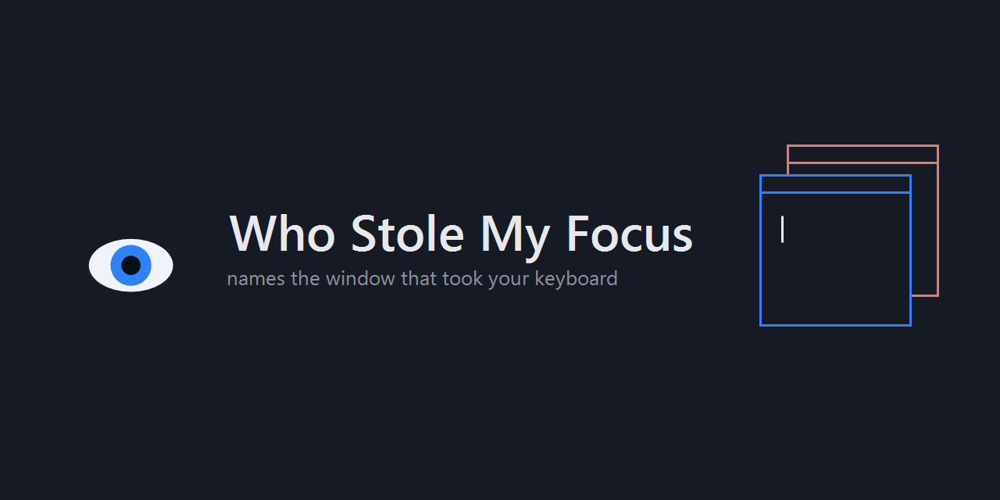
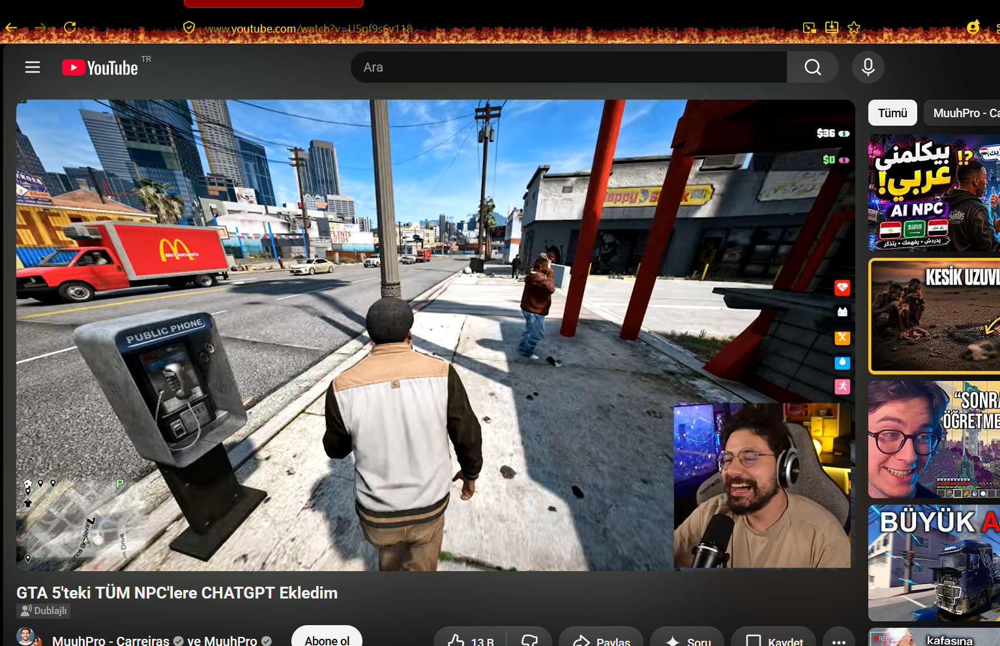
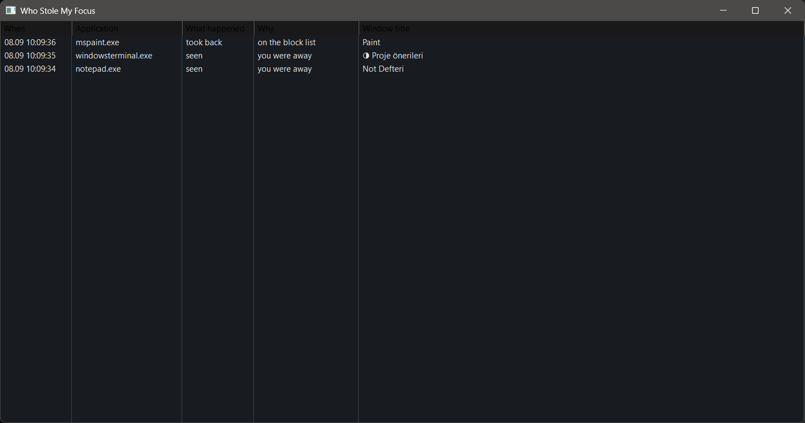
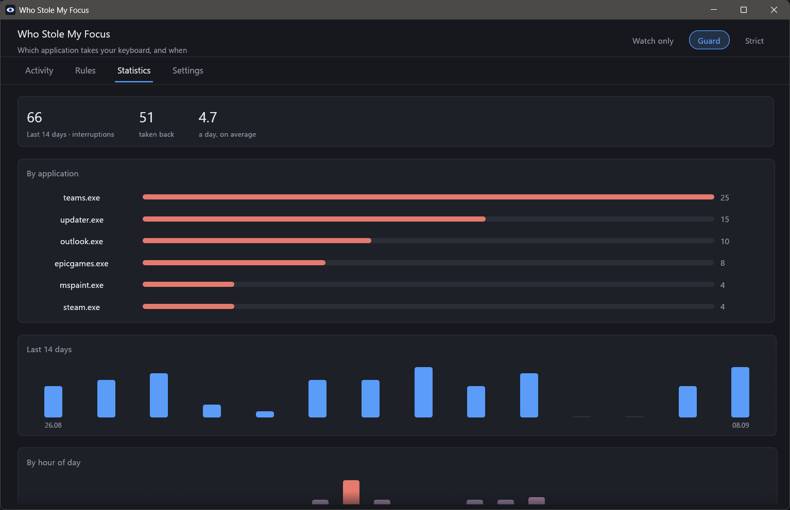
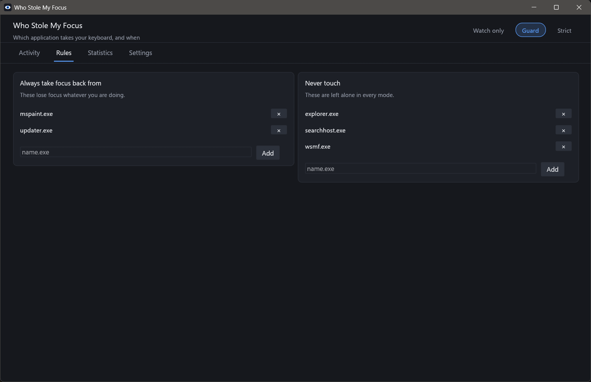

# Who Stole My Focus

[](https://github.com/Talkdedsec/tlk-wsmf/actions/workflows/build.yml)
[](https://github.com/Talkdedsec/tlk-wsmf/releases/latest)
[](https://github.com/Talkdedsec/tlk-wsmf/releases)
[](LICENSE)

You are typing. A window you did not ask for jumps in front and eats the next few
keystrokes. By the time you notice, half a sentence went somewhere else.

This is a Windows tray program that answers two questions: **which application did
that**, and, if you want, **stops it from doing it again**.

[Türkçe](README.tr.md)



## Why this exists

Windows already has a defence against this. The foreground lock timeout is supposed
to stop background applications from calling `SetForegroundWindow` at will. Plenty of
installers quietly set it to `0`, and after that anything can interrupt anything.

The fix has been asked for in Microsoft's own PowerToys repository since 2019 and is
still not there. The registry key that controls it has no interface. The one third
party tool most people find is either abandoned or flagged by Defender.

## What it does

Three modes, switched from the tray icon or the panel:

- **Watch only** (default) — never touches your windows. Records every application
  that took your focus, when, and what its window was called. Start here.
- **Guard** — hands focus back if it was taken while you were typing, and always
  hands it back from applications you put on the block list.
- **Strict** — hands focus back from everything that is not on the allow list.

When it takes focus back it flashes the interrupting window in the taskbar, the same
way Windows does when it blocks a window itself. Nothing is lost. It just waits.

## Two windows

**The quick view** opens on a single click of the tray icon: a plain list of what
just happened, nothing else. It is a Win32 list, so it is on screen instantly.



**The panel** (double click, or "Open the panel") is a separate process with four
tabs — activity, rules, statistics, settings. Because it is its own process, the
part of the program guarding your focus stays small and keeps running even if the
panel is closed, busy, or crashes.

| | |
|---|---|
|  |  |

Both are in English or Turkish, following the Windows display language unless you
pick one yourself.

## Install

Download `wsmf.exe` from [Releases](https://github.com/Talkdedsec/tlk-wsmf/releases)
and run it. One file, no installer, no runtime to install. It appears in the tray.

To have it start with Windows, tick that in the tray menu. To remove it: quit, delete
the exe, and delete `%APPDATA%\wsmf` if you want the log and settings gone too.

## How it decides

A window coming to the front is not automatically a theft — most of the time it is
you, clicking or pressing Alt+Tab. Getting that wrong is worse than the original
problem, so the benefit of the doubt always goes to you:

| Situation | What happens |
|---|---|
| You clicked in the last 400 ms | Left alone |
| A mouse button is down right now | Left alone |
| Alt+Tab or the Windows key is held | Left alone |
| Same application as the window you were in | Left alone |
| On your allow list | Left alone |
| The window you were in has closed or been minimised | Recorded, nowhere to go back to |
| A key was pressed in the last 1.5 s and none of the above | You were typing: this is a theft |
| On your block list | A theft, whatever you were doing |

An application opening usually puts up two or three windows in a few
milliseconds. The first one is answered; the rest are ignored for 400 ms, so a
launch does not turn into a flicker.

If an application keeps grabbing focus, it wins after three tries in ten seconds.
Two programs fighting over the foreground is worse for you than one badly behaved
program, so this one stops and says so in the log.

Every row in that table is a unit test. If you disagree with a decision, turn on
`record_everything` and the log will tell you which row it matched.

## What it does not do

- It does not install a keyboard hook. It asks the system how long since the last
  input and whether a mouse button is down. It never sees which key you pressed.
- It does not touch the network. Nothing leaves your machine.
- It cannot take focus back from an elevated window if it is not elevated itself.
  Windows blocks that on purpose. Such a case is recorded as "could not take it back"
  rather than passed over in silence.
- It does not stop a window from *opening*. It decides where the keyboard goes.

## Antivirus

Reading foreground changes and moving focus is what this program is for, and it is
also what some malware does, so a heuristic engine may take an interest. Releases are
built by GitHub Actions from the tag they claim to be built from, and the workflow is
in this repository. If your scanner still flags it, the whole thing is about four
and a half thousand lines of Rust and you can read all of it.

## Settings

The panel covers everything. The same values live in `%APPDATA%\wsmf\config.toml`,
and editing that file by hand works too — the running copy notices within a second:

```toml
mode = "watch"              # watch, guard, strict
language = "system"         # system, english, turkish
typing_window_ms = 1500     # a keystroke this recent means you were typing
click_grace_ms = 400        # a click this recent means you opened it yourself
blocklist = []              # exe names, lower case, no path
allowlist = ["explorer.exe"]
flash_thief = true          # blink the interrupting window in the taskbar
max_restores = 3            # give up after this many tries
restore_window_secs = 10
log_to_file = true          # %APPDATA%\wsmf\focus.log
record_everything = false   # also record what was left alone, and why
```

The log is tab separated, with untranslated keys, so it stays readable by anything
and survives a change of language:

```
2026-09-08T00:16:11+03:00	restored	blocklist	mspaint.exe	C:\Windows\system32\mspaint.exe	Paint
2026-09-08T00:16:15+03:00	gave_up	persistent	mspaint.exe	C:\Windows\system32\mspaint.exe	Paint
```

## Build

```
cargo build --release
cargo test --release
```

Rust 1.85 or newer, MSVC toolchain. The result is a single executable at
`target\release\wsmf.exe`.

## Tests

`cargo test --release` runs four kinds of test:

- **Decisions** — the table above, one test per row, plus the edges either side of
  each threshold.
- **Files** — settings round trip, a broken config kept aside rather than
  overwritten, absurd numbers pulled back into range, log lines surviving tabs and
  newlines in window titles, and a log line written by a future version not breaking
  this one.
- **Windows** — real windows created and destroyed inside the test: what a window
  reports about itself, that hidden, minimised and destroyed windows are never handed
  focus, and that focus really can be moved between two windows. The system queries
  are exercised too, read only: nothing in your registry is changed by a test run.
- **State and filters** — strike counting and its expiry, the settling window after a
  restore, a pause that has run out, and the activity filter and search.
- **Budget** — a decision must stay well under 10 µs even with a thousand rules
  loaded (it is around a microsecond in practice; the budget leaves room for a busy
  CI runner), the
  tray process must start in under 3 seconds, hold under 48 MB, and use under 0.35 s
  of CPU across six idle seconds. A second launch must exit rather than leave two
  copies running.

The budget tests are why the claim "small and light" is in this README at all.

## Licence

MIT.
