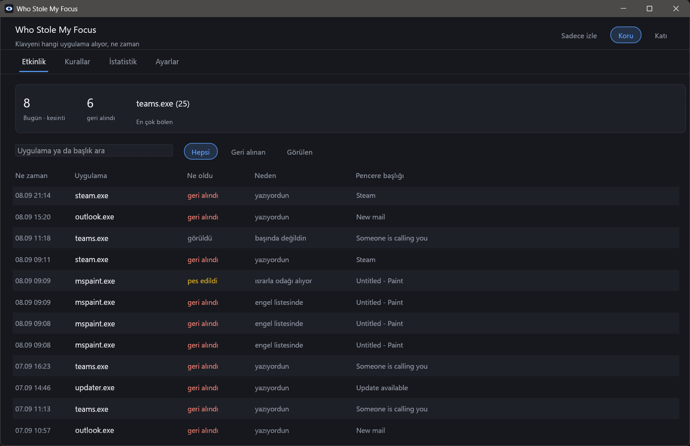
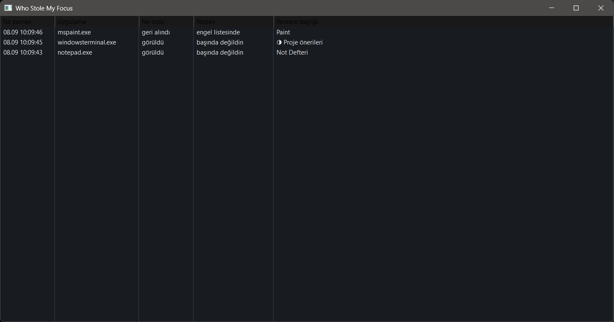
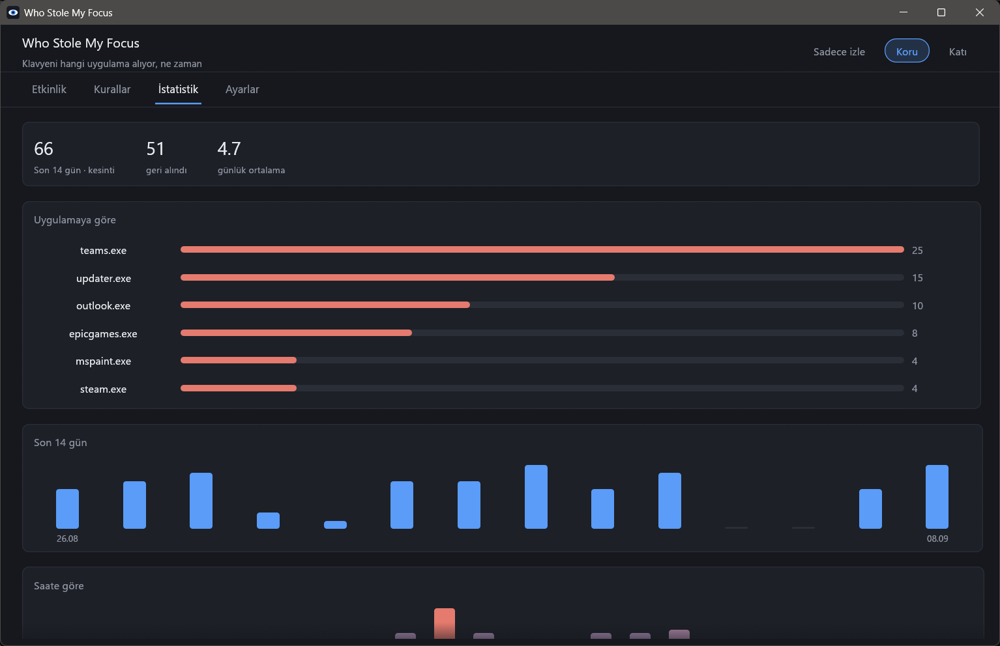
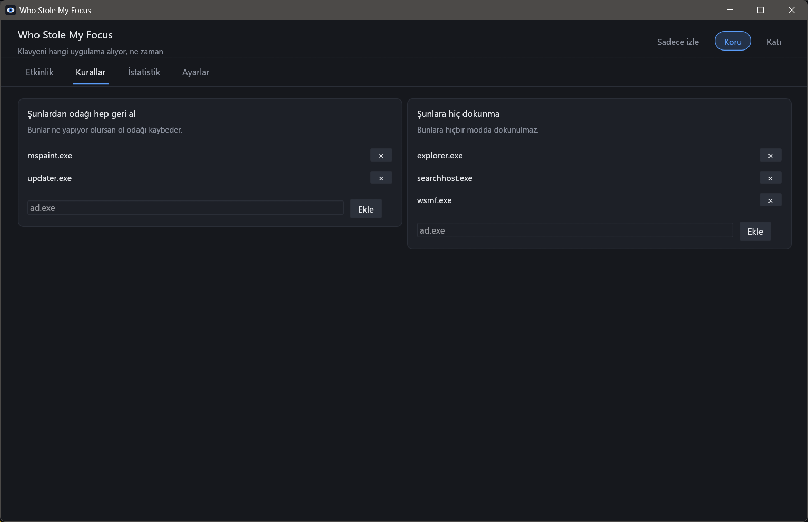

# Who Stole My Focus

Yazıyorsunuz. İstemediğiniz bir pencere öne fırlıyor ve sonraki birkaç tuşu o yiyor.
Fark ettiğinizde cümlenin yarısı başka bir yere gitmiş oluyor.

Bu, iki soruya cevap veren bir Windows tray programı: **bunu hangi uygulama yaptı**,
ve isterseniz **bir daha yapmasın**.

[English](README.md)



## Neden var

Windows'un buna karşı zaten bir savunması var. Foreground lock timeout ayarı, arka
plandaki uygulamaların canı istediğinde `SetForegroundWindow` çağırmasını engellemek
için. Bir sürü kurulum programı bu değeri sessizce `0` yapıyor; ondan sonra her şey
her şeyi bölebiliyor.

Bu özellik Microsoft'un kendi PowerToys deposunda 2019'dan beri isteniyor ve hâlâ
yok. Ayarı kontrol eden registry anahtarının arayüzü yok. İnsanların bulduğu tek
üçüncü parti araç ya terk edilmiş ya da Defender tarafından işaretleniyor.

## Ne yapıyor

Tray ikonundan ya da panelden değişen üç mod:

- **Sadece izle** (varsayılan) — pencerelerinize hiç dokunmaz. Odağı alan her
  uygulamayı, zamanını ve pencere başlığını kaydeder. Buradan başlayın.
- **Koru** — siz yazarken alınan odağı geri verir, ve engel listenizdeki
  uygulamalardan her durumda geri alır.
- **Katı** — izin listesinde olmayan her şeyden odağı geri alır.

Odağı geri aldığında, araya giren pencereyi görev çubuğunda yanıp söndürür; Windows
kendi engellediğinde ne yapıyorsa aynısı. Hiçbir şey kaybolmaz, sadece sırasını
bekler.

## İki pencere

**Hızlı bakış** tray ikonuna tek tıkla açılır: az önce ne olduğunu gösteren düz bir
liste, fazlası yok. Win32 listesi olduğu için anında ekranda.



**Panel** (çift tık ya da "Paneli aç") ayrı bir process ve dört sekmesi var —
etkinlik, kurallar, istatistik, ayarlar. Ayrı process olduğu için odağınızı koruyan
kısım küçük kalır ve panel kapalıyken, meşgulken ya da çökmüş olsa bile çalışmaya
devam eder.

| | |
|---|---|
|  |  |

İkisi de Türkçe ya da İngilizce; kendiniz seçmediğiniz sürece Windows'un dilini
izler.

## Kurulum

[Releases](https://github.com/Talkdedsec/tlk-wsmf/releases) sayfasından `wsmf.exe`
dosyasını indirip çalıştırın. Tek dosya, kurulum yok, ayrıca yüklenecek çalışma
ortamı yok. Tray'de belirir.

Windows ile başlaması için tray menüsünden işaretleyin. Kaldırmak için: çıkın, exe'yi
silin, kayıt ve ayarlar da gitsin isterseniz `%APPDATA%\wsmf` klasörünü silin.

## Kararı nasıl veriyor

Öne gelen her pencere hırsız değildir; çoğu zaman zaten sizsiniz, tıklamışsınız ya da
Alt+Tab yapmışsınızdır. Bunu yanlış yapmak asıl sorundan kötüdür, o yüzden şüphe her
zaman sizin lehinize:

| Durum | Ne oluyor |
|---|---|
| Son 400 ms içinde tıkladınız | Dokunulmaz |
| Şu anda bir fare düğmesi basılı | Dokunulmaz |
| Alt+Tab ya da Windows tuşu basılı | Dokunulmaz |
| Zaten içinde olduğunuz uygulamanın penceresi | Dokunulmaz |
| İzin listenizde | Dokunulmaz |
| İçinde olduğunuz pencere kapandı ya da küçültüldü | Kaydedilir, dönülecek yer yok |
| Son 1,5 sn içinde tuşa basılmış ve yukarıdakilerin hiçbiri yok | Yazıyordunuz: bu bir hırsızlık |
| Engel listenizde | Ne yapıyor olursanız olun hırsızlık |

Bir uygulama açılırken genelde birkaç milisaniye içinde iki üç pencere açar.
İlkine cevap verilir, kalanlar 400 ms boyunca yok sayılır; böylece bir uygulama
açılışı titremeye dönüşmez.

Bir uygulama odağı almakta ısrar ederse, on saniye içinde üç denemeden sonra o
kazanır. İki programın ön plan için kavga etmesi, sizin için tek bir terbiyesiz
programdan daha kötüdür; bu yüzden program durur ve kayda "pes edildi" yazar.

Bu tablodaki her satır bir birim testi. Bir karara katılmıyorsanız
`record_everything` ayarını açın; kayıt size hangi satıra denk geldiğini söyler.

## Ne yapmıyor

- Klavye hook'u kurmuyor. Sisteme son girdiden bu yana ne kadar geçtiğini ve fare
  düğmesinin basılı olup olmadığını soruyor. Hangi tuşa bastığınızı hiç görmüyor.
- Ağa çıkmıyor. Makinenizden hiçbir şey ayrılmıyor.
- Kendisi yükseltilmiş yetkiyle çalışmıyorsa, yükseltilmiş bir pencereden odağı geri
  alamaz. Windows bunu bilerek engelliyor. Böyle bir durum sessizce geçilmiyor, kayda
  "geri alınamadı" olarak yazılıyor.
- Bir pencerenin *açılmasını* engellemiyor. Klavyenin nereye gideceğine karar veriyor.

## Antivirüs

Ön plan değişikliklerini okumak ve odağı taşımak bu programın işi; aynı zamanda bazı
zararlı yazılımların da yaptığı şey, dolayısıyla sezgisel tarayıcılar ilgi
gösterebilir. Sürümler, iddia ettikleri etiketten GitHub Actions ile derleniyor ve
workflow bu depoda. Tarayıcınız yine de işaretlerse, programın tamamı dört buçuk bin
satır civarında Rust ve hepsini okuyabilirsiniz.

## Ayarlar

Panel her şeyi kapsıyor. Aynı değerler `%APPDATA%\wsmf\config.toml` dosyasında
duruyor; dosyayı elle düzenlemek de çalışır, çalışan kopya bir saniye içinde fark
eder:

```toml
mode = "watch"              # watch, guard, strict
language = "system"         # system, english, turkish
typing_window_ms = 1500     # bu kadar yakın bir tuş "yazıyordu" demek
click_grace_ms = 400        # bu kadar yakın bir tıklama "kendisi açtı" demek
blocklist = []              # exe adları, küçük harf, yolsuz
allowlist = ["explorer.exe"]
flash_thief = true          # araya giren pencere görev çubuğunda yanıp sönsün
max_restores = 3            # bu kadar denemeden sonra pes et
restore_window_secs = 10
log_to_file = true          # %APPDATA%\wsmf\focus.log
record_everything = false   # dokunulmayanları ve gerekçesini de kaydet
```

Kayıt dosyası sekmeyle ayrılmış ve çevrilmemiş anahtarlar kullanıyor; böylece her
araçla okunabiliyor ve dil değişince bozulmuyor:

```
2026-09-08T00:16:11+03:00	restored	blocklist	mspaint.exe	C:\Windows\system32\mspaint.exe	Paint
2026-09-08T00:16:15+03:00	gave_up	persistent	mspaint.exe	C:\Windows\system32\mspaint.exe	Paint
```

## Derleme

```
cargo build --release
cargo test --release
```

Rust 1.85 veya üstü, MSVC toolchain. Sonuç `target\release\wsmf.exe` yolunda tek bir
çalıştırılabilir dosya.

## Testler

`cargo test --release` dört tür testi çalıştırır:

- **Kararlar** — yukarıdaki tablo, her satır için bir test, artı her eşiğin iki
  yanındaki sınır durumları.
- **Dosyalar** — ayarların gidip geri gelmesi, bozuk config'in üzerine yazılmak
  yerine saklanması, saçma sayıların aralığa çekilmesi, pencere başlığındaki sekme ve
  satır sonlarının kayıt biçimini bozmaması, gelecekteki bir sürümün yazdığı satırın
  bu sürümü kırmaması.
- **Pencereler** — test içinde gerçekten açılıp kapatılan pencereler: bir pencerenin
  kendisi hakkında ne söylediği, gizli, küçültülmüş ve kapatılmış pencerelere odağın
  asla verilmemesi, ve odağın iki pencere arasında gerçekten taşınabilmesi.
- **Bütçe** — bin kural yüklüyken bile bir karar 2 µs'nin altında kalmalı; tray
  process 3 saniyeden kısa sürede açılmalı, 48 MB'ın altında kalmalı ve altı saniyelik
  boşta beklemede 0,35 saniyeden az CPU kullanmalı. İkinci bir çalıştırma iki kopya
  bırakmak yerine çıkmalı.

"Küçük ve hafif" iddiasının bu README'de yer alabilmesinin sebebi bütçe testleri.

## Lisans

MIT.
